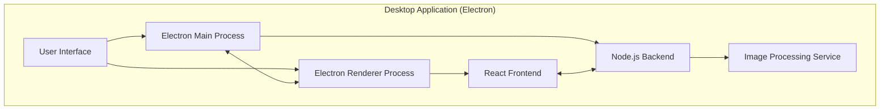

<div align="center">
  

<h1 align="center">LocalSqueeze</h1>

​			       

<div align="center"><a href="./README.md">简体中文</a> | English</div>

<h5 align="center">A feature-rich, efficient and flexible cross-platform desktop image compression application</h5>

</div>

## 📸 Project Screenshots


## ✨ Features
- **🔐 Security First**: All operations are completed locally with zero data leakage risk
- **🔍 High-Quality Compression** - Intelligent compression algorithms that minimize file size while maintaining image quality
- **🚀 Batch Processing** - Process multiple images simultaneously to improve work efficiency
- **🎨 Experience First**: Intuitive interface design with smooth operation experience
- **🔧 Flexible Configuration**: Rich compression parameters to meet professional user needs
- **🌍 Cross-Platform**: Supports Windows, macOS mainstream platforms
- **👁️ Effect Comparison** - Intuitive comparison of before and after compression effects to ensure image quality
- **🌓 Dark Mode** - Supports dark/light theme switching

## 🏆 Product Advantages

### 🆚 Comparison with Similar Products


#### Compared to TinyPNG

- 🔒 **Privacy Security Guarantee** - 100% local processing, image data will not be uploaded to any server, completely protecting user privacy
- 💪 **Better Compression Results** - In actual tests with the same image, LocalSqueeze compressed to 104KB while TinyPNG compressed to 175KB, with no quality difference
- 🚀 **No Network Dependency** - Can be used offline, not limited by network environment
- 💰 **Completely Free** - No API call limits, no paid subscription required
- 🔧 **Highly Customizable** - Supports multiple parameter adjustments such as compression levels and format conversion

#### Compared to Picdiet

- 🎯 **More Supported Image Formats** - Picdiet only supports JPG
- 🎨 **Better Interactive Experience** - Carefully designed user interface with more intuitive and friendly operation flow
- ⚙️ **Richer Configuration Options** - Provides more custom compression parameters to meet different scenario requirements


## 🛠️ Technology Stack



- ⚡ **Electron** - Cross-platform desktop application framework
- ⚛️ **React** - User interface construction
- 📘 **TypeScript** - Type-safe JavaScript superset
- 🎨 **Tailwind CSS** - Utility-first CSS framework
- 🔪 **Sharp** - High-performance Node.js image processing library
- 🔨 **Electron Forge** - Application packaging and publishing tool

## 🚀 Quick Start

### Clone Project

```bash
git clone https://github.com/freeany/LocalSqueeze.git
cd LocalSqueeze
```

### Install Dependencies

```bash
npm install
```

### Start Development Environment

```bash
npm run start
```

## 📦 Build and Package

```bash
# Build installer for current platform
npm run make

# Build Windows platform installer
npm run make:win

# Build macOS platform installer
npm run make:mac
```

## 🚢 Release

```bash
# Release current platform installer to GitHub Release
npm run publish
```

### Automated Build and Release

The project is configured with GitHub Actions workflow. When pushing commits with tags (such as `v1.0.1`), it will automatically trigger builds and publish to GitHub Release.

```bash
git add .
git commit -m "release: v1.0.1"
git tag v1.0.1
git push && git push --tags
```

## 🗂️ Project Architecture

```
src/
├── main.ts           # Electron main process entry
├── preload.ts        # Preload script
├── renderer.ts       # Renderer process entry
├── app.tsx           # React application entry
├── components/       # React components
├── views/            # Page views
└── server/           # Server-side logic
    ├── compression/  # Image compression core logic
    ├── ipc/          # Inter-process communication
    ├── storage/      # Storage management
    └── workers/      # Worker threads
```

## 📝 Open Source License

This project is open sourced under the [MIT](./LICENSE) license

## 📞 Contact Information

- **Author**: lhr
- **Email**: lhr_freeany@163.com
- **Project Homepage**: [https://github.com/freeany/LocalSqueeze](https://github.com/freeany/LocalSqueeze)

## 🌟 Support the Project

If this project helps you, please give it a star ⭐️