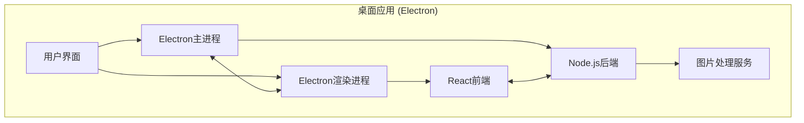

<div align="center">
  

<h1 align="center">LocalSqueeze</h1>

​			       

<div align="center">简体中文 | <a href="./README.en-US.md">English</a></div>
<h5 align="center">一款功能丰富、高效灵活的跨平台桌面图片压缩应用</h5>

</div>

## 📸 项目截图


## ✨ 特性
- **🔐 安全至上**：所有操作均在本地完成，零数据泄露风险
- **🔍 高质量压缩** - 智能压缩策略，在保持图片质量的同时最大程度减小文件大小
- **🚀 批量处理** - 同时处理多张图片，提高工作效率
- **🎨 体验优先**：直观的界面设计，流畅的操作体验
- **🔧 灵活配置**：丰富的压缩参数，满足专业用户需求
- **🌍 跨平台**：支持 Windows、macOS 主流平台
- **👁️ 效果对比** - 直观对比压缩前后的效果，确保图片质量
- **🌓 深色模式** - 支持深色/浅色主题切换

## 🏆 产品优势

### 🆚 与同类产品对比


#### 相比 TinyPNG

- 🔒 **隐私安全保障** - 100% 本地处理，图片数据不会上传到任何服务器，完全保护用户隐私
- 💪 **更优压缩效果** - 实测同一张图片，LocalSqueeze 压缩至 104KB，TinyPNG 压缩至 175KB，质量无差异
- 🚀 **无网络依赖** - 离线即可使用，不受网络环境限制
- 💰 **完全免费** - 无 API 调用限制，无需付费订阅
- 🔧 **高度可定制** - 支持压缩级别、格式转换等多种参数调整

#### 相比 Picdiet

- 🎯 **支持的图片格式更多** - Picdiet 仅支持 JPG
- 🎨 **更佳的交互体验** - 精心设计的用户界面，操作流程更加直观友好
- ⚙️ **更丰富的配置选项** - 提供更多自定义压缩参数，满足不同场景需求


## 🛠️ 技术栈



- ⚡ **Electron** - 跨平台桌面应用框架
- ⚛️ **React** - 用户界面构建
- 📘 **TypeScript** - 类型安全的 JavaScript 超集
- 🎨 **Tailwind CSS** - 实用优先的 CSS 框架
- 🔪 **Sharp** - 高性能 Node.js 图片处理库
- 🔨 **Electron Forge** - 应用打包与发布工具

## 🚀 快速开始

### 克隆项目

```bash
git clone https://github.com/freeany/LocalSqueeze.git
cd LocalSqueeze
```

### 安装依赖

```bash
npm install
```

### 启动开发环境

```bash
npm run start
```

## 📦 构建打包

```bash
# 构建当前平台的安装包
npm run make

# 构建Windows平台安装包
npm run make:win

# 构建macOS平台安装包
npm run make:mac
```

## 🚢 发布

```bash
# 发布当前平台的安装包到GitHub Release
npm run publish
```

### 自动化构建和发布

项目配置了GitHub Actions工作流，当推送带有标签的提交时（如`v1.0.1`），会自动触发构建并发布到GitHub Release。

```bash
git add .
git commit -m "release: v1.0.1"
git tag v1.0.1
git push && git push --tags
```

## 🗂️ 项目架构

```
src/
├── main.ts           # Electron主进程入口
├── preload.ts        # 预加载脚本
├── renderer.ts       # 渲染进程入口
├── app.tsx           # React应用入口
├── components/       # React组件
├── views/            # 页面视图
└── server/           # 服务端逻辑
    ├── compression/  # 图片压缩核心逻辑
    ├── ipc/          # 进程间通信
    ├── storage/      # 存储管理
    └── workers/      # 工作线程
```

## 📝 开源协议

本项目采用 [MIT](./LICENSE) 协议开源

## 📞 联系方式

- **作者**：lhr
- **邮箱**：lhr_freeany@163.com
- **项目主页**：[https://github.com/freeany/LocalSqueeze](https://github.com/freeany/LocalSqueeze)

## 🌟 支持项目

如果这个项目对你有帮助，欢迎点个 star ⭐️
