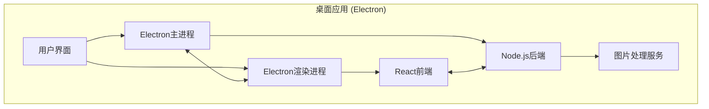

#  LocalSqueeze


```bash
$ echo "What is LocalSqueeze?"
> 一款高效的本地图片压缩工具，保持图片质量的同时最大程度减小文件大小
```

## 📸 项目截图


## ✨ 特性

- 🔍 **高质量压缩** - 智能压缩算法，在保持图片质量的同时最大程度减小文件大小
- 🚀 **批量处理** - 同时处理多张图片，提高工作效率
- 🔄 **格式转换** - 支持多种图片格式之间的转换（JPG/JPEG、PNG、GIF、WEBP等）
- 👁️ **效果对比** - 直观对比压缩前后的效果，确保图片质量
- 📏 **调整尺寸** - 根据需要调整图片尺寸，适应不同场景
- 🔒 **本地处理** - 所有处理在本地完成，保护您的隐私
- 🌓 **深色模式** - 支持深色/浅色主题切换

## 🛠️ 技术栈



- ⚡ **Electron** - 跨平台桌面应用框架
- ⚛️ **React** - 用户界面构建
- 📘 **TypeScript** - 类型安全的 JavaScript 超集
- 🎨 **Tailwind CSS** - 实用优先的 CSS 框架
- 🔪 **Sharp** - 高性能 Node.js 图片处理库
- 🔨 **Electron Forge** - 应用打包与发布工具

## 🚀 快速开始

### 克隆项目

```bash
git clone https://github.com/freeany/LocalSqueeze.git
cd LocalSqueeze
```

### 安装依赖

```bash
npm install
```

### 启动开发环境

```bash
npm run start
```

## 📦 构建打包

```bash
# 构建当前平台的安装包
npm run make

# 构建Windows平台安装包
npm run make:win

# 构建macOS平台安装包
npm run make:mac

# 构建所有平台安装包
npm run make:all
```

## 🚢 发布

```bash
# 发布当前平台的安装包到GitHub Release
npm run publish

# 发布所有平台的安装包到GitHub Release
npm run publish:all
```

### 自动化构建和发布

项目配置了GitHub Actions工作流，当推送带有标签的提交时（如`v1.0.1`），会自动触发构建并发布到GitHub Release。

```bash
git add .
git commit -m "release: v1.0.1"
git tag v1.0.1
git push && git push --tags
```

## 🗂️ 项目架构

```
src/
├── main.ts           # Electron主进程入口
├── preload.ts        # 预加载脚本
├── renderer.ts       # 渲染进程入口
├── app.tsx           # React应用入口
├── components/       # React组件
├── views/            # 页面视图
└── server/           # 服务端逻辑
    ├── compression/  # 图片压缩核心逻辑
    ├── ipc/          # 进程间通信
    ├── storage/      # 存储管理
    └── workers/      # 工作线程
```

## 📝 开源协议

本项目采用 [MIT](./LICENSE) 协议开源

## 📞 联系方式

- **作者**：lhr
- **邮箱**：lhr_freeany@163.com
- **项目主页**：[https://github.com/freeany/LocalSqueeze](https://github.com/freeany/LocalSqueeze)

## 🌟 支持项目

如果这个项目对你有帮助，欢迎点个 star ⭐️
